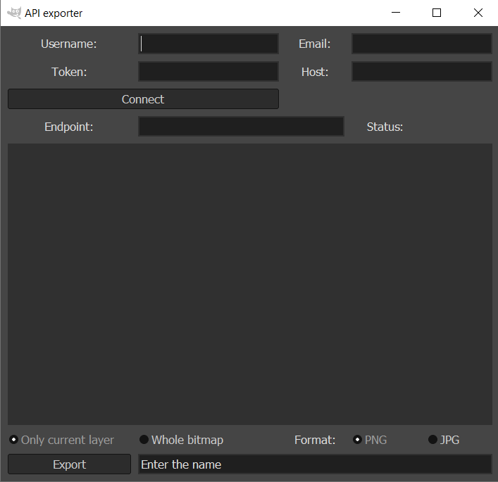

= gimp-rest-api-exporter

Export to RESTfull API plugin for GIMP.

IMPORTANT: Under development. Tested on WIN10, GIMP 2.10.22. export.py was added to %AppData%\GIMP\2.10\plug-ins folder

.Instalation:
. Required version of GIMP is 2.10.22
. Put the exporter.py to the GIMP's plugins folder (if it doesnt work, put the script to %AppData%\GIMP\2.10\plug-ins folder)
. Check the execution rights of exporter.py 

=== Short user manual:

.Simple usage wihout authorization:
. Enter the hostname
. Click the connect button
. Enter the endpoint
. Choose what will be exported and preferable format
. Enter the name
. Click export and wait for the response

TIP: Some UI and Request settings are at the beggining. Feel free to change them

TIP: Plugin uses **POST** request for an export by default. You can change it by setting **EXPORT_HTTP_METHOD** variable. Also you can change the behavior of your Export by editing **export_on_click** callback function (for example by adding additional headers to your request or by changing the structure of the payload with the file for exporting)

TIP: You can also change the authorization simply by calling **set_authorization** method of User object in **connect_on_click** callback function. Method expects to take a dictionary as argument f.e. "{"Authorization": ... }". This dictionary will be added as an additional header to your request

.UI elements:
* Username: your username, which can be added to request body or headers. `Not used by default`.
* Email: your email, which can be added to request body or headers. `Not used by default`.
* Token: your token. `Be default is Bearer token`.  Just enter your token without "Bearer" prefix.
* Host: hostname of the server, where the request will be sent. `Should start with "http://" or "https://"`.
* Connect button: when clicked, plugin will check, if there are any responses from the server. If there were a response, Status will change to `Connected successfully`, to `Connection refused` if not.
* Status: placeholder for short response status. HTTP response code and small message.
* Endpoint: request endpoint. (Check your API docs).
* Response scrolled window: place, where response body will be shown.
* Radio buttons: you can export current layer, or the whole bitmap of your project. `When exporting whole bitmap, the result of 'merge visible layers' will be exported`.
* Format radio buttons: choose the preferable file format. PNG or JPG will be created with default values.
* File name: choose the name for the image, which be exported.
* Export button: will send a request to an endpoint with the image in request body and optional headers added `You have to connect first`.

